# Mockups

En este apartado, se van a presentar los mockups de nuestra aplicación, Keakit, en formato móvil, con el fin de acercar su diseño a todo posible interesado en la misma.

Para ello, en primer lugar debemos tener en cuenta que nuestra aplicación cuenta con tres roles definidos:
- **Arrendador**: Aquel que pone objetos de su propiedad o servicios en alquiler.
- **Arrendatario**: Aquel que alquila kits, artículos individuales o servicios.
- **Administrador**: Aquel que se encarga de la administración de la aplicación.

En el siguiente enlace, se puede acceder al prototipo funcional de la aplicación: [Prototipo funcional](https://keakit-prototype.netlify.app/)

En caso de querer empezar la navegación desde 0, pulsar sobre el logo de la aplicaicón en cualquiera de las pantallas (borrará los datos registrados en el navegador, para poder reiniciar el prototoipo).

## Índice

### [Mockups Generales](#mockups-generales-1)
- [Registro - Core](#registro---core-cu-arrendador01cu-arrendatario01)
- [Inicio de sesión - Core](#inicio-de-sesión---core-cu-arrendador01cu-arrendatario01)
- [Home - No core](#home---no-core)

### [Mockups Arrendador](#mockups-arrendador-1)
- [Subir artículos - Core](#subir-artículos---core-cu-arrendador02cu-arrendador06)
- [Perfil / Mis artículos - Core](#perfil--mis-artículos---core-cu-arrendador03)
- [Filtrado de mis artículos - No Core](#filtrado-de-mis-artículos---no-core-cu-arrendador010)
- [Edición perfil usuario - Core](#edición-perfil-usuario---core-cu-arrendador13cu-arrendatario02)
- [Detalles de artículo - Core](#detalles-de-artículo---core-cu-arrendador03cu-arrendatario04)
- [Edición detalles artículo - Core](#edición-detalles-artículo---core-cu-arrendador04cu-arrendador06)
- [Cartera - Core](#cartera---core-cu-arrendador05cu-arrendador07)
- [Gestión fin alquiler - Core](#gestión-fin-alquiler---core-cu-arrendador08)
- [Notificaciones arrendador - No Core](#notificaciones-arrendador---no-core-cu-arrendador09cu-arrendador11)
- [Consulta alta demanda - No Core](#consulta-alta-demanda---no-core-cu-arrendador12)

### [Mockups Arrendatario](#mockups-arrendatario-1)
- [Crear un kit - Core](#crear-un-kit---core-cu-arrendatario03cu-arrendatario05cu-arrendatario06cu-arrendatario07)
- [Añadir Productos a un Kit - Core](#añadir-productos-a-un-kit---core-cu-arrendatario04cu-arrendatario05)
- [Edicion artículo en kit - Core](#edicion-artículo-en-kit---core-cu-arrendatario10)
- [Pago - Core](#pago---core-cu-arrendatario08)
- [Perfil / Mis alquileres - Core](#perfil--mis-alquileres---core-cu-arrendatario09)
- [Detalles kit - Core](#detalles-kit---core-cu-arrendatario06cu-arrendatario09cu-arrendatario11)
- [Edición perfil usuario - Core](#edición-perfil-usuario---core-cu-arrendatario02)
- [Aviso disponibilidad - No Core](#aviso-disponibilidad---no-core-cu-arrendatario12)
- [Ampliación de búsqueda - No Core](#ampliación-de-búsqueda---no-core-cu-arrendatario13)

### [Mockups Administrador](#mockups-administrador-1)
- [Gestión tipos productos/categorías - Core](#gestión-tipos-productoscategorías---core-cu-admin01cu-admin02)
- [Detalles tipo productos/categorías - Core](#detalles-tipo-productoscategorías---core-cu-admin01cu-admin02)
- [Edición tipo productos/categorías - Core](#edición-tipo-productoscategorías---core-cu-admin01cu-admin02)
- [Gestión usuarios - Core](#gestión-usuarios---core-cu-admin03)
- [Configuración modelo de negocio - Core](#configuración-modelo-de-negocio---core-cu-admin04)

## Mockups Generales

En primer lugar, nos centramos en aquellas pantallas que están generalizadas para todos los tipos de usuario, con diferencias mínimas en función del rol.

### Registro - Core ([CU-ARRENDADOR01](./casos-de-uso-core.md#cu-arrendador01--registro-y-acceso)/[CU-ARRENDATARIO01](./casos-de-uso-core.md#cu-arrendatario01--registro-y-acceso))

Esta es la pantalla que se mostrará al iniciar la aplicación móvil por primera vez, en ella los usuarios de la aplicación podrán registrarse con dos roles distintos: Arrendador o arrendatario. En esta pantalla se deberán rellenar los datos corrrespondientes y pulsar el botón **"Registrarse"** para completar el registro.

  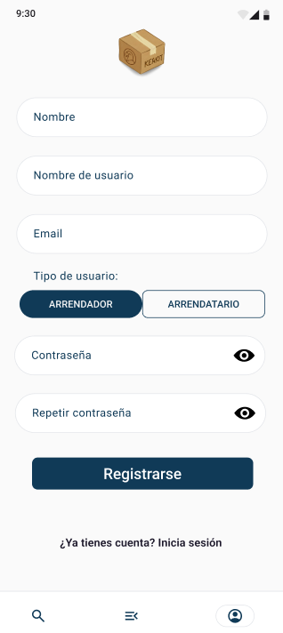
  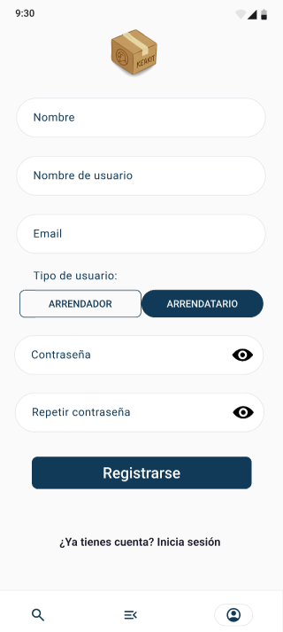

### Inicio de sesión - Core ([CU-ARRENDADOR01](./casos-de-uso-core.md#cu-arrendador01--registro-y-acceso)/[CU-ARRENDATARIO01](./casos-de-uso-core.md#cu-arrendatario01--registro-y-acceso))

Esta pantalla corresponde al inicio de sesión en la aplicación. Tras completar los datos, se nos conducirá a la pantalla de **Home** del rol correspondiente.

  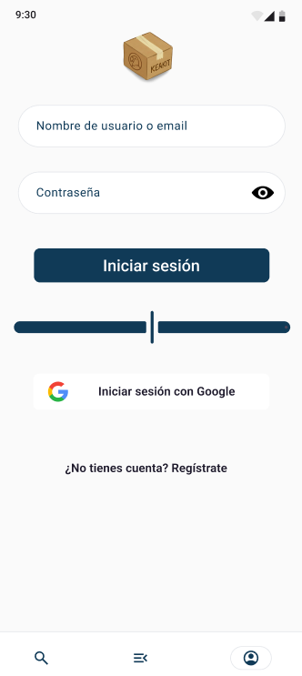

### Home - No core

Esta pantalla representa la pantalla de inicio de la aplicación. Cada tipo de usuario tiene la suya propia, con un diseño personalizado, adaptado al rol.

  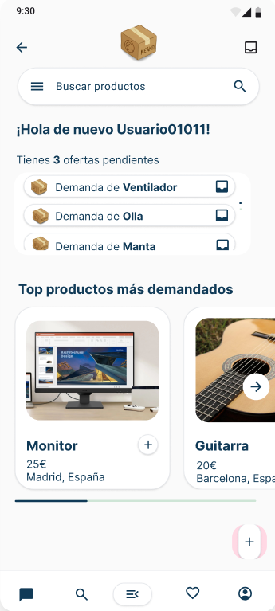
  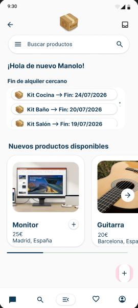
    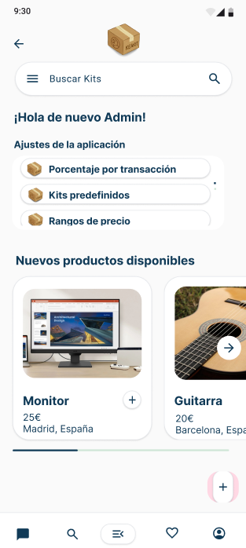

## Mockups Arrendador

Centrándonos en el primer rol mencionado, el Arrendador, se presentan los siguientes mockups.

### Subir artículos - Core ([CU-ARRENDADOR02](./casos-de-uso-core.md#cu-arrendador02--subida-de-artículos)/[CU-ARRENDADOR06](./casos-de-uso-core.md#cu-arrendador06--definición-del-precio-dentro-de-un-rango))

Desde la pantalla de [**Home**](#home---no-core) mencionada anteriormente, y desde la gran mayoría de las pantallas de la aplicación, se podrá pular el icono **"+"**, que nos llevará a la pantalla desde la que se podrán relenar los datos para subir un artículo que queramos poner en alquiler.

  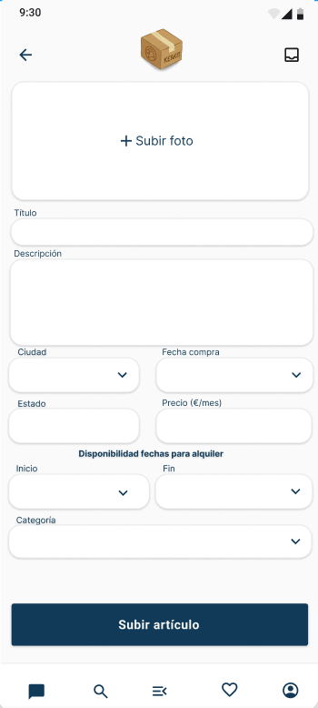
  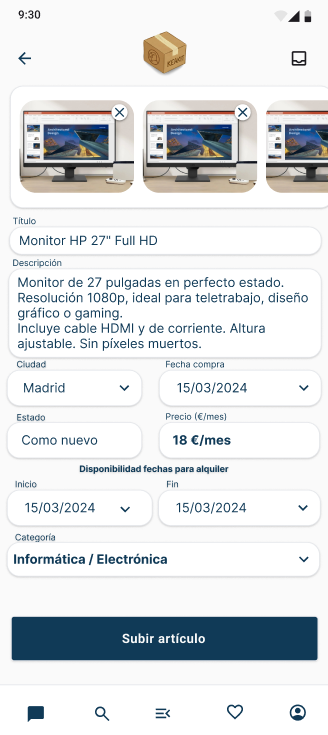

### Perfil / Mis artículos - Core ([CU-ARRENDADOR03](./casos-de-uso-core.md#cu-arrendador03--gestión-de-mis-artículos))

En la barra de navegación, encontraremos un icono correspondiente al perfil del usuario, si entramos, accederemos a la pantalla donde podremos ver nuestro datos de usuario como arrendador, junto con el listado de artículos que tenemos subidos para su alquiler. Desde aquí, también podremos acceder a la edción de nueustro perfil (mediante el icono del lápiz), a nuestra cartera (mediante le botón con este mismo nombre), y a la edición de aquellos artículos que actualmente no están alquilados por ningún usuario arrendatario (mediante el lápiz en cada uno de los artículos).

  

En caso de que alguno de los artículos que tenemos subidos a la aplicación estén alquilados en ese momento, nos aparecerá un cartel que nos lo indicará claramente, junto con la fecha de finalización del alquiler en curso.

### Filtrado de mis artículos - No Core ([CU-ARRENDADOR010](./casos-de-uso-core.md#cu-arrendador10--filtros-en-mis-artículos))

Además de lo anterior, se podrá realizar un filtrado por distintos aspectos como el precio, la categoría, etc. La sección de filtrado tendrá el siguiente aspecto:

  

### Edición perfil usuario - Core ([CU-ARRENDADOR13](./casos-de-uso-core.md#cu-arrendador13--gestión-de-datos-personales)/[CU-ARRENDATARIO02](./casos-de-uso-core.md#cu-arrendatario02--gestión-de-datos-personales))

Al acceder desde la pantalla anterior a la edición del perfil mediante el lápiz, nos encontramos con la siguiente pantalla:

  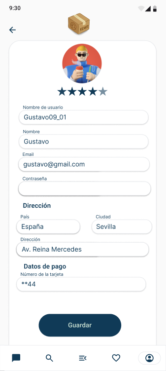

### Detalles de artículo - Core ([CU-ARRENDADOR03](./casos-de-uso-core.md#cu-arrendador03--gestión-de-mis-artículos))

Si pulsamos sobre los artículos que encontramos en la sección "Mis artículos" de la pantalla del perfil **Arrendador**, accederemos a los detalles del mismo, en una pantalla como la que se muestra a continuación.

  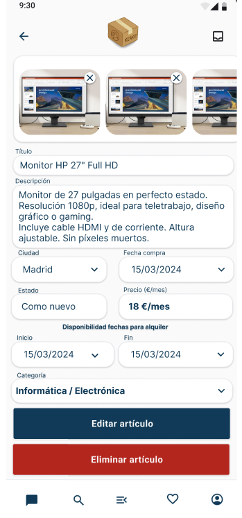

Desde esta pantalla podremos acceder también a la pantalla de edición del artículo, o podremos eliminar el artículo.

### Edición detalles artículo - Core ([CU-ARRENDADOR04](./casos-de-uso-core.md#cu-arrendador04--modificación-y-eliminación-de-artículos)/[CU-ARRENDADOR06](./casos-de-uso-core.md#cu-arrendador06--definición-del-precio-dentro-de-un-rango))

Al acceder a la edición de los detalles de un artículo, se nos muestra la siguiente pantalla:

  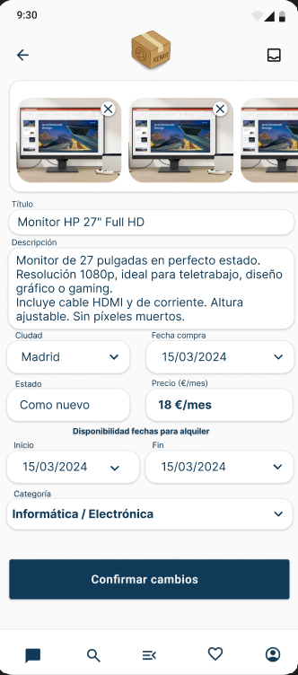

Desde aquí, podremos editar cualquiera de los atributos asociados al artículo.

### Cartera - Core ([CU-ARRENDADOR05](./casos-de-uso-core.md#cu-arrendador05--retirada-de-ingresos)/[CU-ARRENDADOR07](./casos-de-uso-core.md#cu-arrendador07--pago-inicial-con-reparto-automático))

Como ya se ha mencionado, desde el perfil del arrendador, se podrá acceder a la cartera, desde donde se podrán revisar todos los movimientos del cliente en la aplicación, tanto los ingresos por alquiler, como las retiradas a su cuenta bancaria. La cartera viene representada por la siguiente pantalla:

  

### Gestión fin alquiler - Core ([CU-ARRENDADOR08](./casos-de-uso-core.md#cu-arrendador08--finalización-del-alquiler-y-gestión-de-garantía))

A esta pantalla se podrá acceder tras cierto tiempo después del fin de alquiler de un artículo, entrando en los detalles del artículo. Desde ella se deberá confirmar la devolución del artículo (o no) y si el estado en que se ha devuelto es óptimo.

  

### Notificaciones arrendador - No Core ([CU-ARRENDADOR09](./casos-de-uso-core.md#cu-arrendador09--alertas-de-demanda)/[CU-ARRENDADOR11](./casos-de-uso-core.md#cu-arrendador11--notificaciones-de-actividad))

Al arrendador le llegarán distintos tipos de notificaciones, entre ellas:
- Notificación por **FIN DE ALQUILER**.
- Notificación por **DEMANDA** de un producto.
- Notificación por **ALQUILER** de un producto de su propiedad.
Estas notificaciones llegarán, en forma de notificaciones push, como se puede ver reflejado en las siguientes pantallas:

  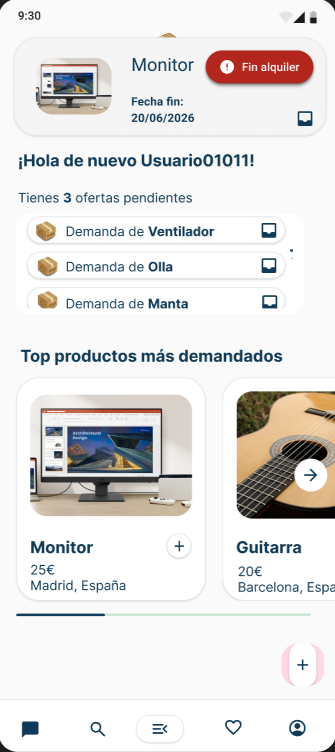
  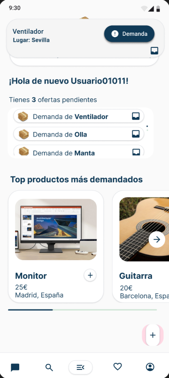
    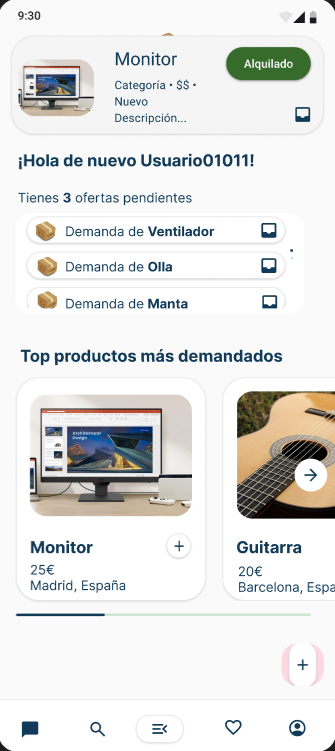

Estas notificaciones, además, quedarán guardadas en un buzón de notificaciones al que se podrá acceder desde cualquier pantalla de la aplicación, en la esquina superior derecha.

  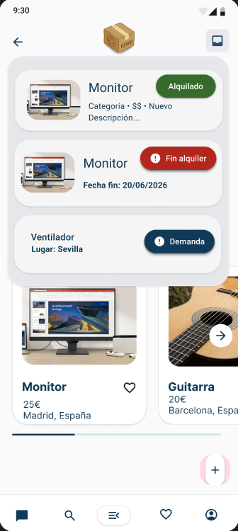

### Consulta alta demanda - No Core ([CU-ARRENDADOR12](./casos-de-uso-core.md#cu-arrendador12--análisis-de-demanda))

En esta pantalla, los arrendadores podrán mirar los artículos más demandados de cada tipo producto/categorá existente en la aplicación.

  
  

La esclamación presente en cada artículo, representa que es un artículo altamente demandado. Si es de color verde, es porque actualmente está disponible el artículo, si está en rojo, es porque en ese momento está alquilado por alguien. Se podrán ver también los detalles del número de usuarios que han alquilado cada uno de los artículos en esta sección.

## Mockups Arrendatario

### Crear un kit - Core ([CU-ARRENDATARIO03](./casos-de-uso-core.md#cu-arrendatario03--creación-y-personalización-de-kits)/[CU-ARRENDATARIO05](./casos-de-uso-core.md#cu-arrendatario05--selección-específica-de-artículos)/[CU-ARRENDATARIO06](./casos-de-uso-core.md#cu-arrendatario06--visualización-dinámica-de-precios)/[CU-ARRENDATARIO07](./casos-de-uso-core.md#cu-arrendatario07--selección-de-fechas-de-alquiler))

Desde prácticamente cualquier pantalla de la aplicación, tras haber iniciado sesión en la aplicación con un perfil de rol **Arrendatario**, se podrá acceder a la pantalla de **creación de un kit** a través del icono **"+"** ubicado en la parte inferior derecha de la pantalla. Esta pantalla tendrá la siguiente composición;

  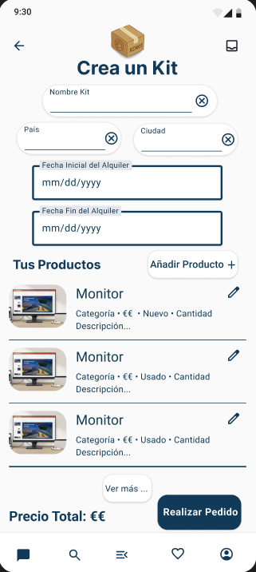

Desde esta pantalla, podremos rellenar los datos necesarios para crear un kit que queramos alquilar, pudiendo añadir cualquier prodcuto disponible en la aplicación en las fechas elegidas. Esta adición de productos, se hace a través del botón **"Añadir Producto +"**.

También, podremos acceder a la edición de determinados datos de los artículos que se van añadiendo al kit, pulsando en el icono del lápiz.

### Añadir Productos a un Kit - Core (CU27/CU26) ([CU-ARRENDATARIO04](./casos-de-uso-core.md#cu-arrendatario04--selección-de-objetos-disponibles)/[CU-ARRENDATARIO05](./casos-de-uso-core.md#cu-arrendatario05--selección-específica-de-artículos))

Desde esta pantalla podremos realizar una búsqueda entre todos los artículos disponibles en la aplicación en las fechas indicadas para poder añadirlo al kit que estamos por alquilar. La pantalla seguiría el siguiente estilo:

  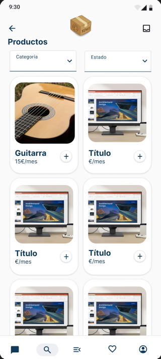

### Edicion artículo en kit - Core ([CU-ARRENDATARIO10](./casos-de-uso-core.md#cu-arrendatario10--gestión-logística-del-alquiler))

Desde esta pantalla podremos editar el tipo de envío que queremos para cada uno de los artículos que hemos incluído en el kit. 

  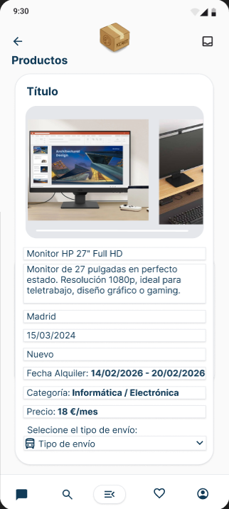

### Pago - Core ([CU-ARRENDATARIO08](./casos-de-uso-core.md#cu-arrendatario08--pago-del-kit))

Desde esta pantalla podremos realizar el pago del kit que hemos montado. En ella tendremos que rellenar los datos de la tarjeta con la que se va a pagar. Además, aparecerán todos los gastos asocuados al alquiler del kit. La pantalla será como se muestra a continuación:

  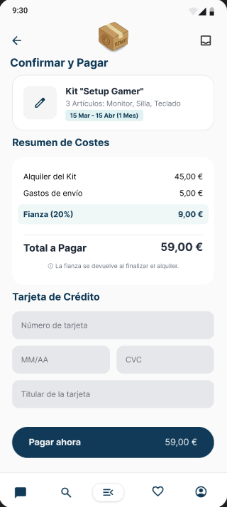

### Perfil / Mis alquileres - Core ([CU-ARRENDATARIO09](./casos-de-uso-core.md#cu-arrendador09--alertas-de-demanda))

Como ya se ha mencionado, en la barra de navegación se encuentra un icono que corresponde al perfil del usuario. Al acceder a esta pantalla con rol Arrendatario, nos encontraremos el perfil del usuario, y los alquileres que tiene el mismo, puediendo entrar a ver sus detalles. También, se podrá acceder a la edición de los datos de si perfil.

  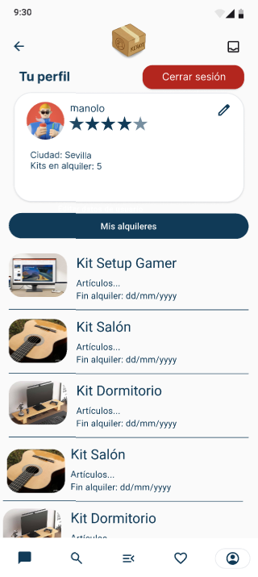

### Detalles kit - Core ([CU-ARRENDATARIO06](./casos-de-uso-core.md#cu-arrendatario06--visualización-dinámica-de-precios)/[CU-ARRENDATARIO09](./casos-de-uso-core.md#cu-arrendatario09--seguimiento-de-alquileres-activos)/[CU-ARRENDATARIO11](./casos-de-uso-core.md#cu-arrendador11--notificaciones-de-actividad))

Si en la pantalla anterior (Perfil / Mis alquileres) pulsamos sobre alguno de los kits que tiene el usuario en alquiler, se podrá acceder a los detalles del mismo. En caso de que aún no se haya recibido el kit, al entrar en los detalles del kit aparecerá una la misma pantalla pero con dos opciones: `RECIBIDO` o `NO RECIBIDO`, que servirán para confirmar la recepción (o no) del kit. Todo esto se observa en las siguientes pantallas:

  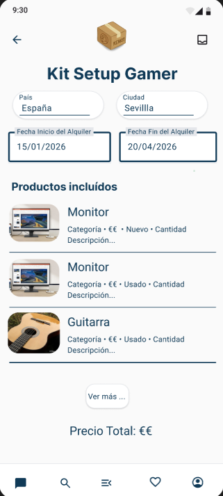
  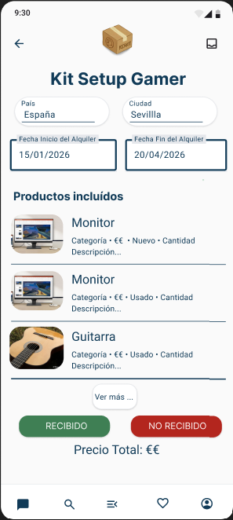

### Edición perfil usuario - Core ([CU-ARRENDATARIO02](./casos-de-uso-core.md#cu-arrendatario02--gestión-de-datos-personales))

Al ingual que para el perfil de arrendador, al acceder mediante el lápiz a la edición del perfil nos encontramos con una pantalla que sigue el siguiente estilo:

  

### Aviso disponibilidad - No Core ([CU-ARRENDATARIO12](./casos-de-uso-core.md#cu-arrendatario12--avisos-de-disponibilidad))

En caso de que al querer añadir un producto al kit, este no esté disponible, podemos indicar que nos avise cuando pase a estar disponible con una notificación en la aplicación.

  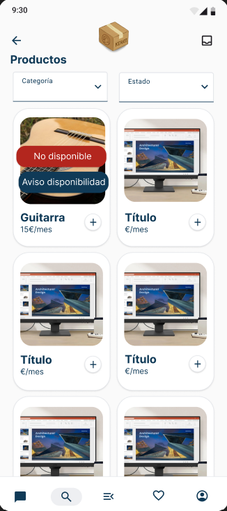

### Ampliación de búsqueda - No Core ([CU-ARRENDATARIO13](./casos-de-uso-core.md#cu-arrendatario13--ampliación-de-búsqueda-geográfica))

En caso de que al hacer una búsqueda de artículos para añadir a un kit, esta no ofrezca ningún resultado, se dará la opción de ampliar la búsqueda a regiones más lejanas (con su consecuente aumento de gastos de envío).

  

## Mockups Administrador

### Gestión tipos productos/categorías - Core ([CU-ADMIN01](./casos-de-uso-core.md#cu-admin01--gestión-del-catálogo)/[CU-ADMIN02](./casos-de-uso-core.md#cu-admin02--definición-de-rangos-de-precio))

Desde esta pantalla el administrador podrá filtrar, buscando el tipo de producto/categoría que desee y puediendo entrar a editarlo o ver sus detalles, si es necesario. También, se podrá acceder a la creación deun nuevo tipo de producto/categoría a través del icono "+" en la parte inferior de la pantalla.

  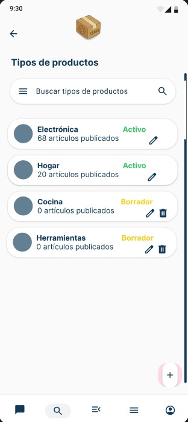

### Detalles tipo productos/categorías - Core ([CU-ADMIN01](./casos-de-uso-core.md#cu-admin01--gestión-del-catálogo)/[CU-ADMIN02](./casos-de-uso-core.md#cu-admin02--definición-de-rangos-de-precio))

Desde esta pantalla, se podrán ver todos los detalles de la categoría, además de poder acceder a su edición mediante el icono del lápiz.

  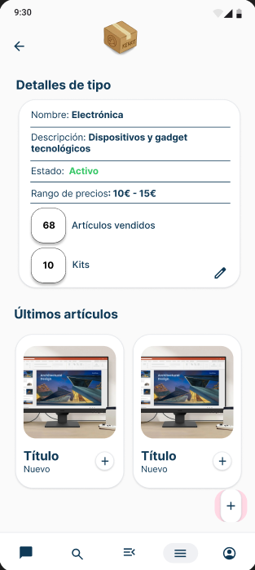

### Edición tipo productos/categorías - Core ([CU-ADMIN01](./casos-de-uso-core.md#cu-admin01--gestión-del-catálogo)/[CU-ADMIN02](./casos-de-uso-core.md#cu-admin02--definición-de-rangos-de-precio))

Desde esta pantalla, se podrán editar los tipos de productos/categorías disponibles en la aplicación. La pantalla de creación de tipos de productos/categorías será exactamente igual, pero con los campos vacíos listos para rellenar.

  

### Gestión usuarios - Core ([CU-ADMIN03](./casos-de-uso-core.md#cu-admin03--gestión-de-usuarios-y-roles))

Desde esta pantalla, el administrador podrá buscar entre todos los usuarios de la aplicación, acceder a sus detalles y eliminarlos.

  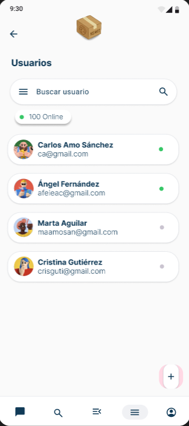

### Configuración modelo de negocio - Core ([CU-ADMIN04](./casos-de-uso-core.md#cu-admin04--configuración-del-modelo-de-negocio))

Dentro de las distintas configuraciones que podrá hacer el administrador, una de las más importantes es el porcentaje por transacción que se lleva la empresa.

  

