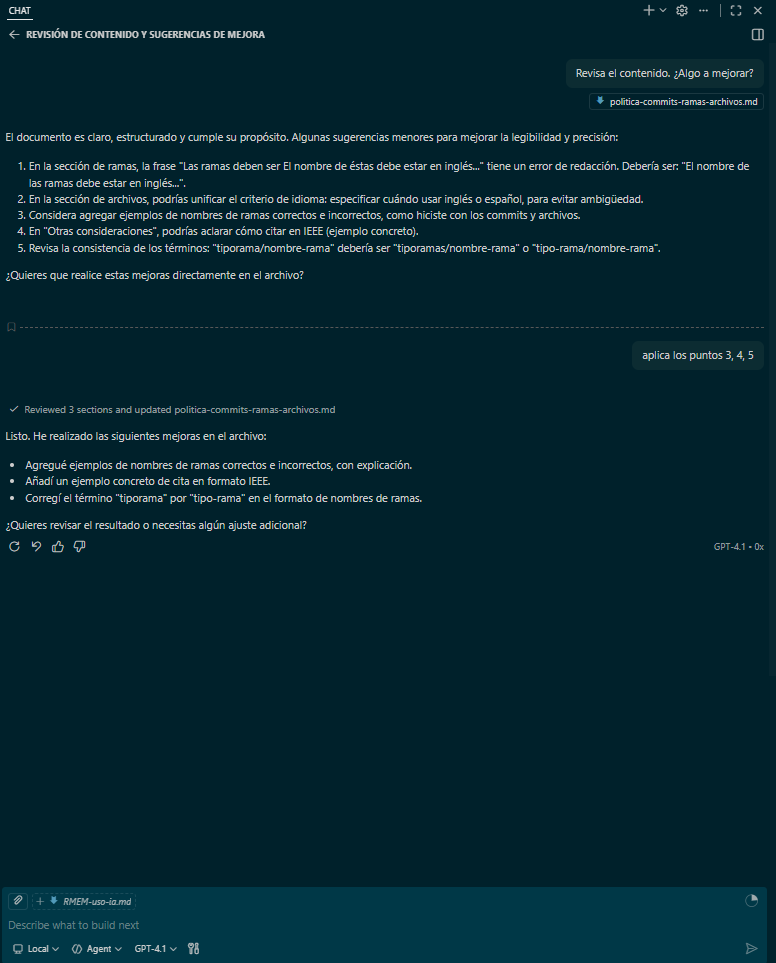

# Informe Declarativo del Uso de la IA

## Introducción
El objetivo de este documento consiste en detallar el uso de herramientas de Inteligencia Artificial durante el desarrollo del proyecto KeaKit. A continuación, se describen las interacciones realizadas con la IA, especificando la herramienta empleada, el prompt utilizado, la respuesta obtenida y el objetivo de la interacción.


## Registro de Interacciones

### Interacción 1
**Usuario:** Rosa María Espinosa Martínez.

**Herramienta y versión de Inteligencia Artificial utilizada:** Copilot en Visual Studio Code, modelo GPT-4.1 en modo Agente.

**Fecha de uso:** 17/02/2026

**Prompt utilizado:** 
```
[Subido como contexto el archivo politica-commits-ramas-archivos.md] "Revisa el contenido. ¿Algo a mejorar?"
```

**Respuesta obtenida:** 
```
"El documento es claro, estructurado y cumple su propósito. Algunas sugerencias menores para mejorar la legibilidad y precisión:

En la sección de ramas, la frase "Las ramas deben ser El nombre de éstas debe estar en inglés..." tiene un error de redacción. Debería ser: "El nombre de las ramas debe estar en inglés...".
En la sección de archivos, podrías unificar el criterio de idioma: especificar cuándo usar inglés o español, para evitar ambigüedad.
Considera agregar ejemplos de nombres de ramas correctos e incorrectos, como hiciste con los commits y archivos.
En "Otras consideraciones", podrías aclarar cómo citar en IEEE (ejemplo concreto).
Revisa la consistencia de los términos: "tiporama/nombre-rama" debería ser "tiporamas/nombre-rama" o "tipo-rama/nombre-rama".
¿Quieres que realice estas mejoras directamente en el archivo?"
```
**Siguiente prompt utilizado:** 
```
"aplica los puntos 3, 4, 5"
```

**Siguiente respuesta obtenida:** 

```
"Listo. He realizado las siguientes mejoras en el archivo:

Agregué ejemplos de nombres de ramas correctos e incorrectos, con explicación.
Añadí un ejemplo concreto de cita en formato IEEE.
Corregí el término "tiporama" por "tipo-rama" en el formato de nombres de ramas.
¿Quieres revisar el resultado o necesitas algún ajuste adicional?"
```

**Objetivo del uso:** Pulir la redacción del documento que estaba redactando antes de subirlo al repositorio.

**Enlace a la conversación:** Copilot no permite compartir enlaces de la conversación. Adjunto captura de pantalla.

<div style="text-align: center;">
  
</div>

---

### Interacción 2
**Usuario:** Alejandro González Macías.

**Herramienta y versión de Inteligencia Artificial utilizada:** ChatGPT, modelo GPT-5.2.

**Fecha de uso:** 18/2/2026

**Prompt utilizado:** 
```
"Hay algún fallo de ortografía aquí?" [Subido el contenido del documento de Análisis_de_Competidores.md]
```

**Respuesta obtenida:** 
```
Sí, hay algunos pequeños fallos de ortografía, acentuación y detalles de redacción. Te los indico de forma clara y directa:

---

## 🔎 Correcciones ortográficas y de estilo

### 1️⃣ Tildes faltantes

* **“mas básica”** → **más básica**
* **“mas básica”** (aparece en Peerby) → **más básica**
* **“amplie su alcance”** → **amplíe su alcance**
* **“infrautilizados de particulares | Objetos domésticos infrautilizados de particulares”** (correcto, pero revisa coherencia de repetición)
* **“Paises bajos”** → **Países Bajos**
* **“Paises Bajos”** → **Países Bajos**
* **“aplicarse una cuota”** (correcto, pero revisar consistencia de redacción formal)
* **“amplie”** (Grover conclusión) → **amplíe**

---

### 2️⃣ Errores gramaticales o de concordancia

* **“añadir múltiple objetos”** → **añadir múltiples objetos**

* **“Solo se permiten alquiler de productos individuales”**
  → **Solo se permite el alquiler de productos individuales**
  o
  → **Solo se permiten alquileres de productos individuales**

* **“Kits y Productos: Solo se permiten alquiler de productos individuales”**
  (mismo error anterior)

* **“Muestra valoraciones del servicio.”**
  Está repetido dentro del apartado Rentik como “Público Objetivo”.
  Parece un error de copia.

* **“Esta última es una información completamente invisible en Peerby.”**
  Mejor redacción:
  → **Esta última es una funcionalidad inexistente en Peerby.**

---

### 3️⃣ Mayúsculas / coherencia de marca

Tienes inconsistencias con el nombre:

* KeaKit
* Keakit

Deberías mantener siempre **KeaKit** (con la misma capitalización).

---

### 4️⃣ Mejoras de estilo (no son errores graves, pero conviene ajustar)

* **“haciendo la experiencia más cómoda y segura, esta última es una información completamente invisible en Peerby.”**
  → Hay una coma mal usada (coma splice). Mejor separar en dos frases.

* **“y otros varios aspectos clave expuestos a continuación.”**
  → Mejor: **“y otros aspectos clave expuestos a continuación.”**

* **“multitud de opciones que lo hacen ser un servicio…”**
  → Mejor: **“multitud de opciones que lo convierten en un servicio…”**

---

### 5️⃣ Detalle técnico de puntuación

En Hygglo:

> “variando desde los 30000 € por un vehículo hasta los 0 €…”

Mejor escribir:

* **30.000 €**
* Evitar “0 €” y usar **sin cobertura para ropa corriente**

---

## 📌 Resumen

No hay errores graves.
El texto está bien redactado en general y transmite profesionalidad.

Los fallos detectados son:

* Algunas tildes faltantes.
* Un par de errores de concordancia.
* Inconsistencia en “KeaKit / Keakit”.
* Pequeños ajustes de estilo.

Si quieres, puedo devolvértelo completamente corregido y pulido en versión final lista para presentar.
```

**Objetivo del uso:** Asegurar que la versión final del documento sobre el análisis de competidores no contenga ningún error ortográfico grave.

**Enlace a la conversación:** [Ver conversación](https://chatgpt.com/share/6995a278-ceac-8005-9a86-4da19e4b53e6)
